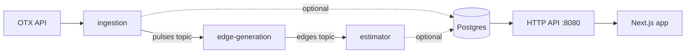

# CTI-Miner field report

How the pipeline works, the HTTP API exactly as it responds today, and how to
build a Next.js visualization on top of it.

## 1. Pipeline

Four `cmd/` binaries, connected only through Kafka. Only the last one reads
Postgres.



**1. `cmd/ingestion`** — polls the OTX pulses endpoint on a timer, paginating
through `next` links. Publishes each pulse as JSON to the edge-generator's
reader topic, keyed by pulse ID. Backs off exponentially
(`otx.initial_backoff` → `otx.max_backoff`) on error. Optionally writes
pulses+indicators to Postgres, and persists the `modified_since` cursor to
`ingestion_state` so a restart resumes instead of re-pulling everything.

**2. `cmd/edge-generation`** — for every indicator on a pulse, checks a
Count-Min Sketch for how often that indicator has been seen. Indicators above
the threshold are "hot" (e.g. a generic IP) and skipped so they don't fan out
into a dense clique. Otherwise it links the pulse to every prior pulse that
shared the same indicator, deduping already-published edges with a Bloom
filter. Constants: bloom = 2^16 bits / 4 hashes, CMS = 4×1024, threshold =
1000.

**3. `cmd/estimator`** — consumes the edge stream into a TRIEST reservoir
sampler (M=5000 edges), which keeps a running *estimate* of the total
triangle count under a fixed memory budget. Logs the estimate on every edge;
optionally stores the raw edge and the running estimate (key
`triangle_estimate` in `ingestion_state`) to Postgres.

**4. `cmd/server`** — the only stage that touches Postgres for reads.
Stateless HTTP handlers, dependency-injected with a store interface — this is
the layer a Next.js frontend talks to.

## 2. Algorithms

**Bloom filter** — "have I published this edge already?" A fixed-size bit
array with `k` hash positions per item. Can false-positive (says "seen" for
something new) but never false-negatives, which is the safe direction for
dedup: worst case you silently drop a duplicate.

**Count-Min Sketch** — "how common is this indicator?" A small 2D counter
table; insert increments one cell per row via a different hash, query takes
the *minimum* across rows (collisions can only over-count). Used as a cheap
frequency gate to stop supernodes from exploding the edge count.

**TRIEST** — "roughly how many triangles exist right now?" Maintains a
uniform random sample of `M` edges seen so far. A triangle only contributes to
the running count while all three of its edges are simultaneously in the
sample; the raw count is corrected by the inverse of that survival
probability to stay unbiased. Below `M` edges the count is exact; above it,
accuracy depends entirely on how large `M` is relative to the stream — a
specific triangle survives with probability
`M(M-1)(M-2) / T(T-1)(T-2)` where `T` is total edges seen. Undersizing `M`
produces a flat, wrong zero, not a slowly-degrading number.

## 3. Data model

Four tables, migrated via plain SQL in `migrations/`. Only fields the app
actually writes are listed — several OTX fields exist on the Go structs but
are never persisted (see §5).

| Table | Key columns | Notes |
|---|---|---|
| `pulses` | `id` pk, name, description, author_name, modified, created, revision, tlp, public, adversary | one row per OTX pulse |
| `indicators` | `id` pk, `pulse_id` fk → pulses.id, indicator, type, created, title, is_active | cascades on pulse delete |
| `edges` | `id` pk, `source_pulse_id` fk, `target_pulse_id` fk, created_at | unique on (source, target) |
| `ingestion_state` | `id` pk, value, updated_at | small key/value table — `otx_modified_since` (ingestion cursor) and `triangle_estimate` (latest TRIEST count) both live here |

## 4. API reference

Every list route returns the same generic envelope; every detail route
returns the bare object. All routes are `GET`-only. CORS is wide open
(`Access-Control-Allow-Origin: *`, including `OPTIONS` preflight) — call
these directly from a Client Component if you want; a server-side proxy is
now optional, not required.

```ts
interface Page<T> {
  items: T[]
  page: number
  limit: number   // default 20 if page/limit omitted or non-numeric
  total: number   // count before pagination, after filtering
}
```

| Route | Query | Returns |
|---|---|---|
| `GET /edges` | `pulse_id`, `after_id`, `page`, `limit` | `Page<Edge>` — edges touching that pulse on either side |
| `GET /pulses` | `ids`, `modified_since`, `include_indicators`, `page`, `limit` | `Page<Pulse>` — indicators omitted unless `=true` |
| `GET /pulses/{id}` | — | `Pulse` — always with indicators |
| `GET /indicators` | `type`, `page`, `limit` | `Page<Indicator>` — e.g. `type=IPv4` |
| `GET /indicators/{id}` | — | `Indicator` |
| `GET /stats` | — | `Stats` — see below, not paginated |

**Delta polling** — `/edges?after_id=<last id seen>` returns only edges
created after that row id (ordered ascending, so track the max `id` from the
last page). `/pulses?modified_since=<ISO timestamp>` does the same for
pulses, ordered by `modified` ascending — mirrors the cursor `ingestion`
already tracks internally. Neither needs a `page`/`limit` loop for polling;
just re-request with the last cursor on an interval.

**Batch fetch** — `/pulses?ids=a,b,c` returns exactly those pulses in one
call (`ids` wins over `modified_since` if both are given) — use it to
lazy-load pulse detail for a set of graph nodes instead of eagerly fetching
everything up front.

Wire shapes, exactly as the server sends them:

```jsonc
// GET /edges?limit=1
{
  "items": [{ "id": 1, "Source": "6aafdebd17a2a06ea32538c4", "Target": "6aaf9e25ae5e16f5c3e92de6" }],
  "page": 1, "limit": 1, "total": 155
}
```

```jsonc
// GET /stats
{
  "triangle_estimate": 42,
  "total_pulses": 586,
  "total_indicators": 5141,
  "total_edges": 155,
  "pulses_by_tlp": { "white": 420, "green": 166 },
  "indicators_by_type": { "IPv4": 3800, "domain": 900, "FileHash-SHA256": 441 }
}
```

```jsonc
// GET /pulses/{id}
{
  "id": "6aafdebd17a2a06ea32538c4",
  "name": "SMTP Intrusion identified by Sentinel",
  "description": "...", "author_name": "FNTuncer",
  "modified": "2026-09-20T13:25:17.416000",
  "created": "2026-09-20T13:25:17.416000",
  "revision": 1, "tlp": "white", "public": 1,
  "adversary": "Automated Scanner",
  "indicators": [{
    "id": 4501318048, "indicator": "171.234.162.101", "type": "IPv4",
    "created": "2026-09-20T13:25:18", "content": "", "title": "",
    "description": "", "expiration": null, "is_active": 1, "role": null,
    "PulseID": "6aafdebd17a2a06ea32538c4", "PulseName": ""
  }],
  "tags": null, "targeted_countries": null, "malware_families": null,
  "attack_ids": null, "references": null, "industries": null,
  "extract_source": null, "more_indicators": false
}
```

Errors are always `{ "error": string }` — `400` for a malformed indicator id,
`404` for an id that doesn't exist, `500` for anything on the database side.

## 5. Read before you build

> **Casing is inconsistent on two fields.** `Edge.Source`/`Edge.Target` and
> `Indicator.PulseID`/`Indicator.PulseName` have no JSON tag in Go, so they
> serialize PascalCase while every other field is snake_case. Type them
> exactly as shown above.

> **Several Pulse/Indicator fields are always empty.** `tags`,
> `malware_families`, `attack_ids`, `references`, `industries`,
> `extract_source` on Pulse, and `content`, `description`, `expiration`,
> `role` on Indicator exist on the Go struct for the raw OTX payload, but the
> storage layer never writes them — they always come back `null`/`""` from
> this API.

> **Pagination has no upper bound.** `limit` is just a slice bound with no
> server-side cap, so a graph view can request the whole edge set in one call
> with a generously high `limit` instead of looping pages.

## 6. Wiring a Next.js app to it

App Router, fetching server-side by default. The Go server never needs to
change.

### Typed client, mirroring the Go generic

```ts
// lib/cti/types.ts
export interface Page<T> { items: T[]; page: number; limit: number; total: number }

export interface Edge { id: number; Source: string; Target: string }

export interface Indicator {
  id: number; indicator: string; type: string; created: string
  title: string; is_active: number
  PulseID: string; PulseName: string
}

export interface Pulse {
  id: string; name: string; description: string; author_name: string
  modified: string; created: string; revision: number; tlp: string
  public: number; adversary: string; indicators: Indicator[]
}

export interface Stats {
  triangle_estimate: number
  total_pulses: number
  total_indicators: number
  total_edges: number
  pulses_by_tlp: Record<string, number>
  indicators_by_type: Record<string, number>
}
```

```ts
// lib/cti/client.ts
const BASE = process.env.CTI_API_URL! // e.g. http://server:8080 inside compose

async function get<T>(path: string, revalidate = 30): Promise<T> {
  const res = await fetch(`${BASE}${path}`, { next: { revalidate } })
  if (!res.ok) throw new Error(`${path} -> ${res.status}`)
  return res.json()
}

export const cti = {
  edges: (q: { pulseId?: string; afterId?: number; page?: number; limit?: number } = {}) =>
    get<Page<Edge>>(`/edges?${new URLSearchParams({
      ...(q.pulseId && { pulse_id: q.pulseId }),
      ...(q.afterId && { after_id: String(q.afterId) }),
      ...(q.page && { page: String(q.page) }),
      ...(q.limit && { limit: String(q.limit) }),
    })}`),
  pulses: (q: { ids?: string[]; modifiedSince?: string; includeIndicators?: boolean; page?: number; limit?: number } = {}) =>
    get<Page<Pulse>>(`/pulses?${new URLSearchParams({
      ...(q.ids && { ids: q.ids.join(",") }),
      ...(q.modifiedSince && { modified_since: q.modifiedSince }),
      ...(q.includeIndicators && { include_indicators: "true" }),
      ...(q.page && { page: String(q.page) }),
      ...(q.limit && { limit: String(q.limit) }),
    })}`),
  pulse: (id: string) => get<Pulse>(`/pulses/${id}`),
  indicators: (q: { type?: string; page?: number; limit?: number } = {}) =>
    get<Page<Indicator>>(`/indicators?${new URLSearchParams({
      ...(q.type && { type: q.type }),
      ...(q.page && { page: String(q.page) }),
      ...(q.limit && { limit: String(q.limit) }),
    })}`),
  stats: () => get<Stats>("/stats", 10),
}
```

`CTI_API_URL` is a plain server-side env var (no `NEXT_PUBLIC_` prefix) — it
never needs to reach the browser bundle, since every call above runs on the
server.

### A paginated list page (Server Component)

```tsx
// app/pulses/page.tsx
import { cti } from "@/lib/cti/client"

export default async function PulsesPage({
  searchParams,
}: { searchParams: Promise<{ page?: string }> }) {
  const page = Number((await searchParams).page ?? 1)
  const { items, total, limit } = await cti.pulses({ page, limit: 25 })

  return (
    <table>
      <tbody>
        {items.map((p) => (
          <tr key={p.id}>
            <td><a href={`/pulses/${p.id}`}>{p.name}</a></td>
            <td>{p.adversary}</td>
            <td>{p.tlp}</td>
          </tr>
        ))}
      </tbody>
      {/* page * limit < total -> render a "next" link to ?page=page+1 */}
    </table>
  )
}
```

### A live triangle-count tile

`revalidate: 10` on `cti.stats()` gives you polling for free in a Server
Component — Next.js refetches in the background once the window elapses.

```tsx
// app/stats-tile.tsx
import { cti } from "@/lib/cti/client"

export default async function StatsTile() {
  const s = await cti.stats()
  return (
    <dl>
      <dt>Estimated triangles</dt><dd>{s.triangle_estimate.toLocaleString()}</dd>
      <dt>Pulses</dt><dd>{s.total_pulses.toLocaleString()}</dd>
      <dt>Edges</dt><dd>{s.total_edges.toLocaleString()}</dd>
    </dl>
  )
}
```

### Polling for new data only

Track the last cursor client-side and pass it back in on every poll instead
of re-fetching the whole collection — since CORS is open, this can run
straight from a Client Component:

```tsx
"use client"
import { useEffect, useRef, useState } from "react"

export function useNewEdges(apiBase: string, intervalMs = 5000) {
  const [edges, setEdges] = useState<{ id: number; Source: string; Target: string }[]>([])
  const afterId = useRef(0)

  useEffect(() => {
    const tick = async () => {
      const res = await fetch(`${apiBase}/edges?after_id=${afterId.current}&limit=1000`)
      const page = await res.json()
      if (page.items.length) {
        afterId.current = page.items[page.items.length - 1].id
        setEdges((prev) => [...prev, ...page.items])
      }
    }
    const id = setInterval(tick, intervalMs)
    tick()
    return () => clearInterval(id)
  }, [apiBase, intervalMs])

  return edges
}
```

### The graph view

Pulses are nodes, `/edges` rows are links. Fetch both server-side, hand them
to a client-only force-directed renderer —
[react-force-graph](https://www.npmjs.com/package/react-force-graph)
(canvas/WebGL, wraps [d3-force](https://www.npmjs.com/package/d3-force)) is
the least code for this shape of data.

```tsx
// app/graph/page.tsx (server)
import { cti } from "@/lib/cti/client"
import GraphView from "./graph-view"

export default async function GraphPage() {
  const [{ items: edges }, { items: pulses }] = await Promise.all([
    cti.edges({ limit: 5000 }),
    cti.pulses({ limit: 5000 }),
  ])
  const nodes = pulses.map((p) => ({ id: p.id, name: p.name, adversary: p.adversary }))
  const links = edges.map((e) => ({ source: e.Source, target: e.Target }))
  return <GraphView nodes={nodes} links={links} />
}
```

```tsx
// app/graph/graph-view.tsx
"use client"
import dynamic from "next/dynamic"
const ForceGraph2D = dynamic(() => import("react-force-graph-2d"), { ssr: false })

export default function GraphView({ nodes, links }: { nodes: any[]; links: any[] }) {
  return (
    <ForceGraph2D
      graphData={{ nodes, links }}
      nodeLabel="name"
      nodeAutoColorBy="adversary"
      linkDirectionalParticles={1}
    />
  )
}
```

### Optional: proxying through a Route Handler

CORS is open, so a Client Component can call the Go server directly (as the
polling hook above does) — a proxy isn't required anymore. It's still worth
reaching for if you'd rather not expose the API's real address to the
browser, or want a single place to add auth/rate-limiting later.

```ts
// app/api/cti/[...path]/route.ts
export async function GET(req: Request, { params }: { params: Promise<{ path: string[] }> }) {
  const { path } = await params
  const qs = new URL(req.url).search
  const res = await fetch(`${process.env.CTI_API_URL}/${path.join("/")}${qs}`)
  return new Response(res.body, { status: res.status, headers: res.headers })
}
```

The browser then calls `/api/cti/indicators?type=IPv4` — same origin as the
Next.js app, so no CORS headers are ever needed on the Go side.

## 7. References

- Next.js App Router — <https://nextjs.org/docs/app>
- Go `net/http` (ServeMux routing patterns used by the API) — <https://pkg.go.dev/net/http>
- react-force-graph — <https://www.npmjs.com/package/react-force-graph>
- d3-force — <https://www.npmjs.com/package/d3-force>
- De Stefani, Epasto, Riondato, Upfal — *TRIÈST: Counting Local and Global
  Triangles in Fully-Dynamic Streams with Fixed Memory Size*, KDD 2016
- Bloom filter — <https://en.wikipedia.org/wiki/Bloom_filter>
- Count–min sketch — <https://en.wikipedia.org/wiki/Count%E2%80%93min_sketch>
